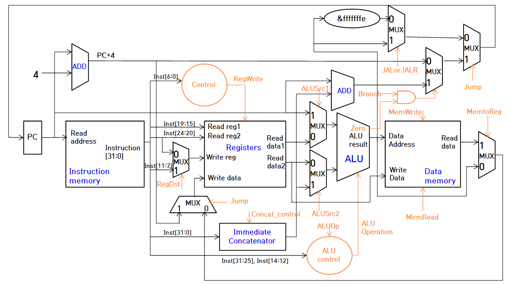

# Tiny RISC-V CPU

## Introduction

This repository contains RTL of a simple CPU architecture that implements our miniaturized version of the [RISC-V Instruction Set](https://riscv.org/). This project was designed and written as a result of a lab assignment during the computer architecture course at KAIST.

Our implementation includes a few variants:  

- Single-cycle CPU
- Multi-cycle CPU
- Pipelined CPU
- Multi-cycle CPU with direct-mapped cache

## Diagram

## Supported RISC-V Instructions

| Instruction | Type | Semantics |
|---|:---:|:---:|
| `JAL` |  |  |
| `JALR` |  |  |
| `BEQ` |  |  |
| `BNE` |  |  |
| `BLT` |  |  |
| `BGE` |  |  |
| `BLTU` |  |  |
| `BGEU` |  |  |
| `LW` |  |  |
| `SW` |  |  |
| `ADDI` |  |  |
| `SLTI` |  |  |
| `SLTIU` |  |  |
| `XORI` |  |  |
| `ORI` |  |  |
| `ANDI` |  |  |
| `SLLI` |  |  |
| `SRLI` |  |  |
| `SRAI` |  |  |
| `ADD` |  |  |
| `SUB` |  |  |
| `SLL` |  |  |
| `SLT` |  |  |
| `SLTU` |  |  |
| `XOR` |  |  |
| `SRL` |  |  |
| `SRA` |  |  |
| `OR` |  |  |
| `AND` |  |  |

## Reference
- [Andrew Waterman, Krste Asanović, SiFive Inc., 2017, *The RISC-V Instruction Set Manual (Version 2.2)*](https://riscv.org/specifications/)